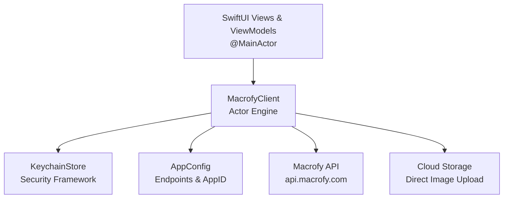

# Macrofy iOS QuickStart Guide

Official native Swift & SwiftUI starter kit for Macrofy. Embed AI meal vision, barcode resolution, and nutrition tracking into iOS apps against the live Macrofy API (`api-v0`).

---

## 1. Project Overview & Architecture

The application is structured with zero third-party dependencies, relying exclusively on Apple's first-party frameworks: `Foundation`, `SwiftUI`, `Combine`, `CryptoKit`, and `Security` (iOS Keychain).




### Swift Concurrency & Strict Isolation Model
The codebase is configured for modern Swift concurrency (`Swift 5.9+ / Swift 6`):
- **Actor Isolation**: Network requests, tokens, and active sessions are managed inside the `MacrofyClient` actor to prevent data races.
- **MainActor Separation**: The presentation layer (`MacrofyAppViewModel`, `ContentView`) is isolated to `@MainActor`.
- **Nonisolated Domain Models**: All models (`Models.swift`), configuration (`Configuration.swift`), errors (`MacrofyError.swift`), and utilities (`SignatureUtility.swift`, `KeychainStore.swift`) conform to `Sendable` and are marked `nonisolated` to allow seamless passing across actor boundaries without concurrency warnings.

---

## 2. Project File Structure

| File | Role & Implementation Details |
| :--- | :--- |
| `Configuration.swift` | Holds `AppConfig` defining the production base URL (`https://api.macrofy.com`) and the tenant `appId`. |
| `SignatureUtility.swift` | Computes 64-character lowercase hexadecimal HMAC-SHA256 signatures using `CryptoKit` for the client authentication handshake. |
| `KeychainStore.swift` | Thread-safe Keychain wrapper using `Security.framework` (`kSecClassGenericPassword`) to securely persist and retrieve session tokens and user data across app launches. |
| `Models.swift` | Complete `Codable`, `Sendable` schemas matching the Macrofy API: Auth, Foods, Barcodes, AI Image Scanning, Profiles & Mifflin-St Jeor Goals, Food Diary, and Daily Totals. |
| `MacrofyError.swift` | Strongly typed `MacrofyError` conforming to `LocalizedError`, mapping HTTP status codes (400, 401, 403, 404, 429, 500), JSON decoding errors, direct uploads, and SSE timeouts. |
| `MacrofyClient.swift` | Reusable actor-based API client implementing all Macrofy API endpoints, session management, direct cloud storage uploads, and SSE streaming. |
| `ContentView.swift` | SwiftUI view and `@MainActor MacrofyAppViewModel` demonstrating authentication, diary log rendering, daily totals, and AI scan simulation. |
| `Nutrition_AI_QuickStartApp.swift` | Standard SwiftUI App entry point launching `ContentView`. |

---

## 3. How the App Is Configured

### 1. API Configuration (`Configuration.swift`)
The base URL is preconfigured to Macrofy's live API:
```swift
public nonisolated struct AppConfig {
    public static let baseURL = URL(string: "https://api.macrofy.com")!
    public static let appId = "YOUR_APP_ID" // Replace with your portal App ID
}
```

### 2. Authentication Handshake (`SignatureUtility.swift` & `ContentView.swift`)
Macrofy authenticates mobile clients using a cryptographic signature:
```swift
let signature = SignatureUtility.generateHMAC(
    appSecret: devAppSecret,
    userId: developerUserId
)
let response = try await client.connect(
    appId: AppConfig.appId,
    userId: developerUserId,
    signature: signature
)
```
Upon a successful connect call, `MacrofyClient` automatically stores the 30-day Bearer JWT in the iOS Keychain and injects `Authorization: Bearer <token>` into all subsequent authenticated requests.

> **Security note**: `devAppSecret` in `ContentView.swift` is wrapped in `#if DEBUG`, so it is always `nil` — and therefore never compiled into the binary — for Release/TestFlight/App Store builds. `SignatureUtility.generateHMAC` uses `appSecret` exactly as issued by the Developer Portal — its literal UTF-8 bytes are the HMAC key, even though the secret is formatted as a hex-looking string; do not hex-decode it first, or every signature will be rejected. Because `HMAC_SHA256(appSecret, userId)` is deterministic, treat any generated signature as sensitive and short-lived: generate it immediately before calling `connect`, never log it, and prefer proxying this exchange through your backend (Step 5 below) so the secret and signature never reach the client at all.

### 3. Food Diary & Daily Progress
`MacrofyAppViewModel.loadDailyData()` fetches diary entries and daily aggregate totals in parallel:
```swift
async let entries = client.getDiaryEntries(userId: user.id, date: today)
async let totals = client.getDailyTotals(userId: user.id, date: today)
self.diaryEntries = try await entries
self.dailyTotals = try await totals
```

### 4. AI Vision Meal Scanning Pipeline
The application demonstrates the full meal analysis lifecycle via `analyzeAndLogMeal(jpegData:)`:
1. **Create Scan Job (`POST /v1/scan/image`)**: Requests a job and receives a short-lived pre-signed PUT upload URL.
2. **Binary Upload (`PUT uploadUrl`)**: Streams the raw JPEG bytes directly to cloud storage without passing binary data through application web servers.
3. **SSE Pub/Sub Stream (`GET /v1/scan/image/:jobId/stream`)**: Subscribes to Server-Sent Events emitted by Macrofy's vision engine.
4. **Auto-Logging (`POST /v1/users/:id/diary`)**: Once meal recognition completes, logs the parsed meal and ingredients directly into the user's food diary and refreshes daily totals.

---

## 4. Setup & Running the QuickStart

### Prerequisites
- macOS Sonoma or later
- Xcode 15.0+ or Xcode 16.0+
- iOS Deployment Target: iOS 16.0+ (iOS 17.0+ recommended)

### Quick Run Steps
1. Open `Nutrition AI QuickStart.xcodeproj` in Xcode.
2. Open `Configuration.swift` and replace `"YOUR_APP_ID"` with your registered Application ID from the Macrofy Developer Portal.
3. Open `ContentView.swift` and locate `devAppSecret` inside `MacrofyAppViewModel`. Replace `"YOUR_APP_SECRET"` with your 64-character development secret. This value is wrapped in `#if DEBUG`, so it only exists in Debug builds — Release/TestFlight/App Store builds always get `nil` and must use the backend handshake described in Step 5 of Section 5 below.
4. Select an iOS Simulator (e.g., iPhone 16 Pro) and press **Cmd + R** to run.
5. In the simulator:
   - Tap **Connect User** to execute the cryptographic handshake.
   - Once connected, view the Daily Totals and Logged Meals sections.
   - Tap **Simulate Camera Scan (Salmon Bowl)** to observe the real-time AI scan state machine.

---

## 5. How to Build on Top of This Project

Here are the concrete steps to evolve this QuickStart into a full production application:

### Step 1: Replace Sample Image with Real Camera / Photo Picker
In `ContentView.swift`, the AI scan demo currently uses mock JPEG bytes. Replace this with SwiftUI's `PhotosPicker` or `AVCaptureSession`:

```swift
import PhotosUI

struct MealPhotoPickerView: View {
    @ObservedObject var viewModel: MacrofyAppViewModel
    @State private var selectedItem: PhotosPickerItem?

    var body: some View {
        PhotosPicker(selection: $selectedItem, matching: .images) {
            Label("Scan Meal from Photo", systemImage: "camera")
        }
        .onChange(of: selectedItem) { newItem in
            Task {
                if let data = try? await newItem?.loadTransferable(type: Data.self) {
                    await viewModel.analyzeAndLogMeal(jpegData: data)
                }
            }
        }
    }
}
```

### Step 2: Add Live Barcode Scanning
Add a barcode scanning sheet using VisionKit or `AVCaptureMetadataOutput`:

```swift
// Example calling MacrofyClient once barcode is detected:
func handleBarcodeDetected(_ barcode: String) async {
    // Sanitize to numeric digits only (7 to 14 digits)
    let cleanCode = barcode.filter { $0.isNumber }
    do {
        let food = try await client.scanBarcode(barcode: cleanCode)
        print("Scanned product: \(food.name), Calories: \(food.macros.energy ?? 0)")
    } catch {
        print("Barcode lookup failed: \(error.localizedDescription)")
    }
}
```

### Step 3: Implement Text-Based Food Search & Autocomplete
Build a searchable food catalog view using `client.searchFoods(query:limit:)`:

```swift
struct FoodSearchView: View {
    @State private var searchQuery = ""
    @State private var searchResults: [FoodItem] = []
    let client = MacrofyClient()

    var body: some View {
        List(searchResults) { food in
            VStack(alignment: .leading) {
                Text(food.name).font(.headline)
                if let brand = food.brand {
                    Text(brand).font(.subheadline).foregroundStyle(.secondary)
                }
                Text("\(Int(food.macros.energy ?? 0)) kcal | P: \(Int(food.macros.protein ?? 0))g")
                    .font(.caption)
            }
        }
        .searchable(text: $searchQuery)
        .task(id: searchQuery) {
            guard searchQuery.count >= 2 else {
                searchResults = []
                return
            }
            do {
                try await Task.sleep(nanoseconds: 300_000_000) // 300ms debounce
            } catch {
                return // Superseded by a newer keystroke; let the new task take over.
            }
            guard !Task.isCancelled,
                  let results = try? await client.searchFoods(query: searchQuery, limit: 20),
                  !Task.isCancelled else { return }
            self.searchResults = results
        }
    }
}
```

### Step 4: Add User Profile & Mifflin-St Jeor Goals
Allow users to update their stats and automatically compute customized macro goals:

```swift
func updateUserProfile(userId: String) async throws {
    let input = UserProfileInput(
        age: 30,
        gender: .male,
        height: HeightImperial(feet: 5, inches: 10), // must be a complete pair, or omitted entirely
        weight: 175,
        activityLevel: .moderate,
        calorieDeficit: .maintain,
        dietType: .highProtein
    )
    let profileWithGoals = try await client.updateProfile(userId: userId, input: input)
    print("New daily target: \(profileWithGoals.goals.calories) kcal")
}
```

### Step 5: Secure Production Handshake (Backend Architecture)
For production releases, **never send `appSecret`, or the HMAC signature it produces, to the iOS client**. `HMAC_SHA256(appSecret, userId)` is deterministic, so anyone who captures the signature in transit could replay it to request another 30-day JWT for that user. The fix is to keep the *entire* handshake — including the call to `POST /api/auth/connect` itself — on your backend, and return only the resulting JWT to the device:

```
iOS Client                     Your Backend                  Macrofy API
    |                               |                             |
    | 1. Request session (userId)   |                             |
    |------------------------------>|                             |
    |                               | 2. Compute HMAC SHA-256     |
    |                               |    using appSecret          |
    |                               | 3. POST /api/auth/connect   |
    |                               |    (appId, userId, signature)
    |                               |---------------------------->|
    |                               | 4. Returns 30-Day Bearer JWT|
    |                               |<-----------------------------|
    | 5. Returns JWT only           |                             |
    |<-------------------------------|                             |
```
With this flow, neither `appSecret` nor the signature it produces ever reaches the device — only the resulting JWT does — which eliminates the signature-replay risk entirely. If you need additional protection against a compromised network path, ask Macrofy support whether `POST /api/auth/connect` supports a challenge/nonce option.

### Step 6: Token Auto-Refresh
Before the 30-day JWT expires, call `client.refreshSession()` to maintain continuous authentication without requiring the user to reconnect:

```swift
func refreshTokenIfNeeded() async {
    do {
        _ = try await client.refreshSession()
    } catch {
        // Fall back to re-running the connect handshake
    }
}
```

---

## 6. API Guidelines & Guardrails

1. **Empty Body Header Constraint**: Fastify returns `400 Bad Request` if `Content-Type: application/json` is sent on `GET` or `DELETE` requests that have no body. `MacrofyClient.execute` already guards against this by checking `if let body = body`.
2. **Height Field Pairing**: The API persists height as a single value server-side, so `heightFeet` and `heightInches` must always be sent together or omitted entirely. `UserProfileInput.height: HeightImperial?` enforces this at the type level — construct it via `HeightImperial(feet:inches:)` or leave it `nil`; there is no way to set only one component.
3. **Date Formatting**: Diary endpoints expect strict `YYYY-MM-DD` string format (e.g., `2026-10-08`). Do not send full ISO-8601 timestamps with times.
4. **Barcode Validation**: Barcode lookups require 7 to 14 numeric characters. Always strip spaces, hyphens, and letters prior to making requests.
5. **Cloud Storage Upload Content-Type**: The `Content-Type` specified when creating a scan job (e.g., `image/jpeg`) must match the `Content-Type` header passed in the direct binary `PUT` upload.
